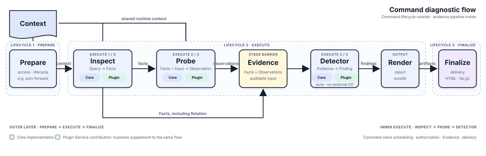

# Doctor

[English](README.md) | [简体中文](README_CN.md)

> 懂业务的 Kubernetes 应用诊断工具。

Doctor 可以理解为一个增强版 `kubectl`。`kubectl` 理解 Kubernetes 对象；Doctor 还理解一个应用由
哪些 Service 组成。Service 是 Doctor 的基本诊断单元，Pod、Container 和 Process 则是 Service 下的
运行目标与证据来源。

Doctor 以本地 CLI 运行在 Doctor Host，通过受限的 Kubernetes 和业务访问能力进入目标环境，再把原始
证据和离线报告交付回本机。


## Doctor 如何诊断一个应用

Doctor 从组成 Application 的 Service 出发，再从宽泛的服务事实逐步深入到具体问题所需的证据：



| 诊断面 | 命令 | Doctor 关注的问题 |
|---|---|---|
| Service 状态 | `doctor inspect` | 匹配的 Pod 与 Container、镜像、Ready、重启、终止状态、CPU/内存 requests 与 limits，以及按需取得的配置 |
| 业务数据 | `doctor tenant`、`doctor data` | 租户维度的配置与模型目录，以及 Service 贡献的 biz-id 关联数据 |
| 可观测性 | `doctor trace`、`doctor log`、`doctor metric` | 一次请求经过的链路、相关 Service 日志和诊断窗口内的指标 |
| 运行时取证 | `doctor cpu`、`doctor mem`、`doctor net` | 具体 Service 运行实例的线程栈、堆内存与网络包 |
| Agent 应用 | `doctor model`、`doctor mcp` | Model 和 MCP 的配置、连通性、调用结果与服务端证据 |

`doctor inspect` 展示观察到的 workload 事实，而不是把它们压缩成一个简单的“健康/不健康”结论。其中
的资源数据是 Kubernetes requests 与 limits；实际使用量归 Metric 与运行时诊断所有。

业务数据按查询维度组织：

- **Tenant**：`doctor tenant` 汇集租户内共享的配置与模型目录。
- **User**：与用户关联的数据；通用的 user 维度采集尚未支持。
- **Biz ID**：`doctor data` 汇集各 Service 围绕 conversation、request 或其它业务标识贡献并关联的数据。

## 跨证据面工作流

- `doctor collect` 调用选中的 Inspect、Tenant、Data、Trace、Log 和 Metric Collector，并把各自报告组合为
  一份离线交付。tenant 与 biz-id 仍由对应 Collector 独立解释；Collect 不推导不同 scope 间的关系、
  不产生负载，也不改变任何单项命令的采集语义。
- `doctor http` 在需要主动复现问题时执行受控请求。
- `doctor perf` 产生有界的真实业务负载，记录请求结果，并把压测窗口与 Metric、代表请求的 Trace 和
  Log 关联起来。它可能产生业务数据或模型费用，因此始终由用户显式触发并确认。
- `doctor chat` 组合模型、受限工具和当前 Plugin 的 Skill，使用与确定性命令相同的应用知识回答开放式
  排查问题。

有些诊断需要的工具或权限并不存在于业务容器中。`doctor image`、`doctor debug` 和 `doctor install`
会显式准备诊断镜像、临时调试环境或工具。任何可能改变目标环境的操作都会先展示并确认；只读采集不会
隐藏这些准备动作。

## Core 与 Plugin

Doctor Core 与具体业务无关，负责 Kubernetes 访问、通用 Collector 与运行时工具、证据编排、分析和
交付，不包含特定应用的 Service 名称、私有协议或 Schema。

版本化 Plugin 描述一个应用的 Service Catalog。每个 Service 可以把 Capability 作为业务补充接入 Core
的同一条流程：Inspect Capability 把 Query 转为 Fact（RelationFact 也是 Fact），Probe Capability 在
一次调度中把 Input 转为 Observation。Capability 同时贡献业务语义，并声明执行前需要准备的目标数据和
访问权限；Command 与 Harness 仍拥有调度、授权、Evidence 和交付。

一次典型排查从 `doctor inspect` 开始，再用 `doctor collect` 汇集所需的 tenant、业务与可观测证据；当
组合证据已经指向具体 Service 或协议后，再进入相应的运行时或 Agent 专项命令。

## 仓库结构

| 路径 | 用途 |
|---|---|
| `cli/` | Doctor Core CLI、Collector、Evidence 模型与离线报告 |
| `toolkit/` | 独立版本的诊断工具、debug image 与离线系统软件包 |
| `server/` | 可选 Doctor server 的宿主边界 |
| `packages/agent/` | 本地 Chat 与 server host 共用的 Agent runtime |
| `packages/plugin/` | Plugin、Service 和 Capability 公共契约 |
| `plugins/example/` | 最小且业务中立的 Plugin 示例 |

## 开发

环境要求：[Bun](https://bun.sh/) 和 Go。

```bash
bun install
bun run typecheck:plugin-sdk
bun run typecheck:agent
bun run typecheck:example-plugin
bun run typecheck:cli
bun run test:plugin-sdk
bun run test:agent
bun run test:cli
```

构建所有平台的二进制到 `dist/`：

```bash
make build
```

只构建本机 macOS 二进制：

```bash
make build-local
```

按单个平台、平台矩阵或大一统归档构建 Toolkit：

```bash
make -C toolkit build OS=linux ARCH=arm64
make -C toolkit build-matrix
make -C toolkit build-all
```

Core 不再内嵌 Toolkit 可执行文件。把匹配的 `doctor-toolkit-*.tar` 放在 Doctor 同目录或当前工作目录；
大一统归档可同时服务平台不同的 Doctor Host 与 Kubernetes Target。

要让 Doctor 理解一个具体应用，可以从 [`plugins/example`](plugins/example) 开始，实现描述其 Service、
Capability 和 Skill 的 Plugin。

更深入的设计说明见 [`cli/docs/kernel.md`](cli/docs/kernel.md)、
[`cli/docs/plugin.md`](cli/docs/plugin.md) 和 [`docs/chat.md`](docs/chat.md)。
