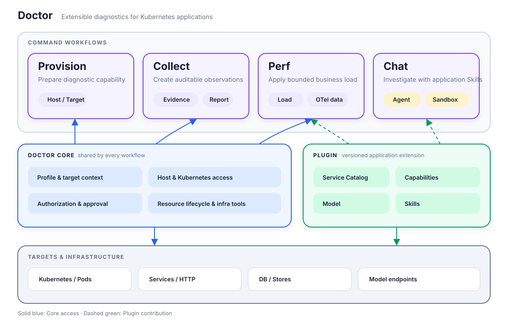
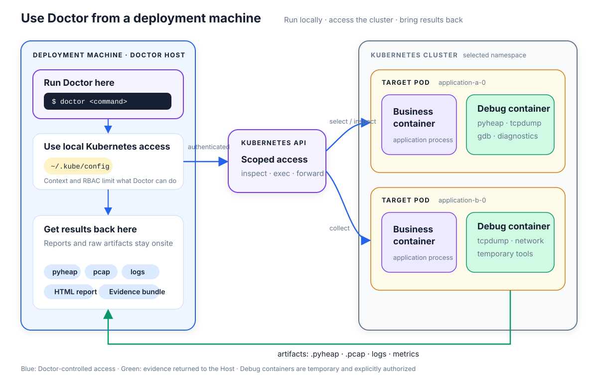

# Doctor

[English](README.md) | [简体中文](README_CN.md)

> 面向 Kubernetes 应用的可扩展诊断工具。

Doctor 是一个本地优先的 CLI，用于采集可复现的诊断证据并开展诊断对话。它以应用感知能力增强
`kubectl`：Core 知道如何访问并安全操作用户选择的目标，Plugin 则告诉 Doctor 一个应用包含哪些
Service，以及这些 Service 的业务数据代表什么。

Doctor 提供三条平级工作流：Provision 准备诊断能力，Collect 生成可审计的 Evidence 和报告，Chat
让 Agent 在沙箱中结合应用 Skill 开展诊断。三者共享同一套 profile、目标、访问与授权上下文。



## Doctor 如何工作

| 工作流 | 用途 | 结果 |
|---|---|---|
| Provision | 显式准备 Doctor Host 或 Target 所需的 image、debug environment、诊断工具等能力 | 已就绪的能力或可见的状态变更 |
| Collect | 检查目标、执行受限 Probe，并运行确定性 Detector | Evidence、Coverage、Finding 与离线报告 |
| Chat | 组合模型、Plugin Skill 和受控工具开展开放式诊断 | 交互式诊断对话 |

Provision、Collect 和 Chat 是相互独立的命令工作流，而不是同一引擎的不同模式。它们复用 Core
提供的访问和基础设施原语，但各自拥有独立的结果与生命周期。内置 Collector 覆盖 CPU、内存、
网络、HTTP、Trace、Metric、Model 和 Store 等领域。

Doctor 在部署机上运行，通过受限的 Kubernetes access 进入现场。它可以使用经过明确授权的 debug
container 执行集群内诊断，再把原始产物和离线报告交付回 Doctor Host。



## Core 与 Plugin

Core 与 Plugin 构成 Doctor 最主要的扩展边界：

| 组件 | 负责内容 |
|---|---|
| Core | Profile 与目标选择、通用 Host/Kubernetes 访问、授权与资源生命周期、确定性采集、Evidence、报告和交互宿主 |
| Plugin | 以版本化方式打包应用 Service、业务 Capability 和 Skill |

Core 把访问能力绑定到用户选择的目标，并负责权限检查、port-forward 生命周期等共享 Kubernetes
操作。Plugin 消费这份受限上下文来定位应用数据，自行完成业务相关的 HTTP 和数据库访问，再返回
中性结果或临时 capability handle。私有协议、schema 和固定查询保留在 Plugin 内部，不泄漏到开源
Core。

一个 Plugin 可以描述组成某个应用的全部 Service，并在同一版本中交付多个 Capability、Model 访问
声明和 Skill。Service Capability 扩展确定性命令，Model 与 Skill 同时扩展 Chat。

## 仓库结构

| 路径 | 用途 |
|---|---|
| `cli/` | 自包含的 Doctor CLI、Collector、Evidence 模型与离线报告 |
| `server/` | 可选 Doctor server 的宿主边界 |
| `packages/agent/` | 本地 Chat 与 server host 共用的宿主中立 Agent runtime |
| `packages/plugin/` | `@compforge/doctor-plugin` 公共契约与 Plugin 工具 |
| `plugins/example/` | 最小且业务中立的 Plugin 示例 |

## 开发

环境要求：[Bun](https://bun.sh/) 和 Go。

```bash
bun install
bun run typecheck:plugin-sdk
bun run typecheck:agent
bun run typecheck:example-plugin
bun run typecheck:cli
bun run test:plugin-sdk
bun run test:agent
bun run test:cli
```

构建所有平台的二进制到 `dist/`：

```bash
make build
```

只构建本机 macOS 二进制：

```bash
make build-local
```

生成的 Core CLI 只包含通用访问和诊断能力。Plugin 命令始终可见；当前 profile 未选择兼容 Plugin
时，命令会明确提示缺少哪项 Capability。

## Chat runtime

`doctor chat` 在沙箱中运行 `@compforge/doctor-agent` 及受限工具。Profile 中的 `llm` 配置优先；没有
配置时，Doctor 可以从当前 Plugin 的 Model Capability 中选择 LLM，并使用 Plugin 提供的 inference
连接。当前 Plugin 同时提供 Agent 可以使用的版本化 Skill。

`doctor chat --server` 会显式选择 `ServerAgent` 并使用 profile 的 `server`；仅配置 endpoint 不会隐式
改变执行位置。本地宿主与 server host 投影相同的 AgentUE/chat-tui 交互模型，并通过不同的宿主接口
复用同一个 Agent package。

## Plugin 边界

`@compforge/doctor-plugin` 定义 Plugin 可以声明什么，以及 Doctor 提供哪些目标受限的 Capability。
Plugin 是受信任扩展，但仍位于应用语义一侧。可以从 [`plugins/example`](plugins/example) 开始，再阅读
[`cli/docs/plugin.md`](cli/docs/plugin.md) 了解完整设计。

要让 Doctor 理解一个具体项目，只需开发一个 Plugin：用 Service Catalog 描述服务组成，用 Capability
接入业务数据和模型，用 Skill 注入业务知识与排查方法，而无需修改 Doctor Core。

Skill 是 Plugin 内的版本化资源，继承 Plugin 的选择和信任关系，不建立独立的全局 Skill 生命周期。
`doctor version` 会输出 Doctor Core 版本，以及当前发行版内嵌 Plugin 的精确身份。

更深入的边界说明见 [`cli/docs/kernel.md`](cli/docs/kernel.md)、
[`cli/docs/plugin.md`](cli/docs/plugin.md) 和 [`docs/chat.md`](docs/chat.md)。
